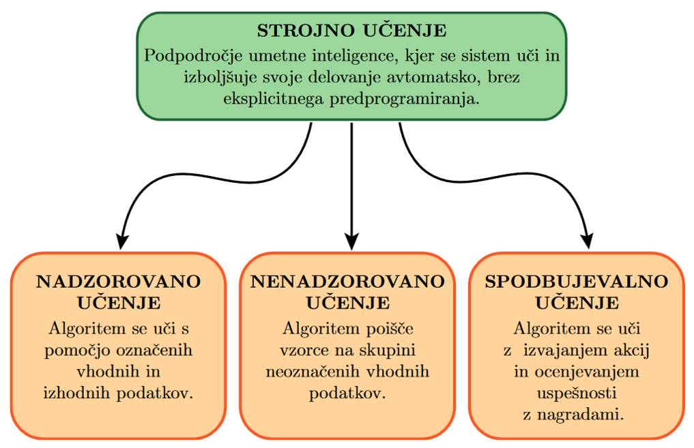
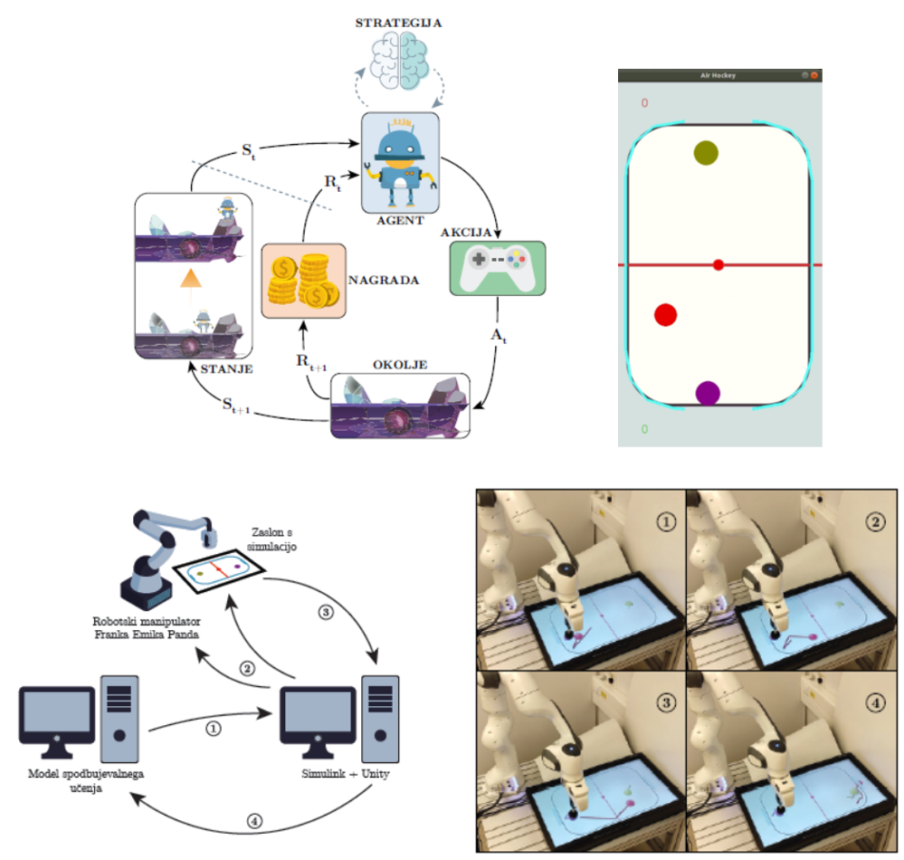
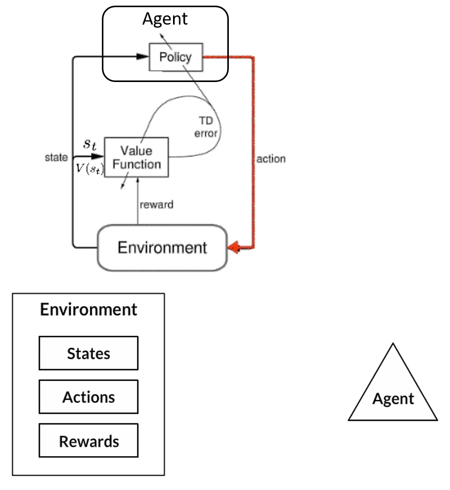
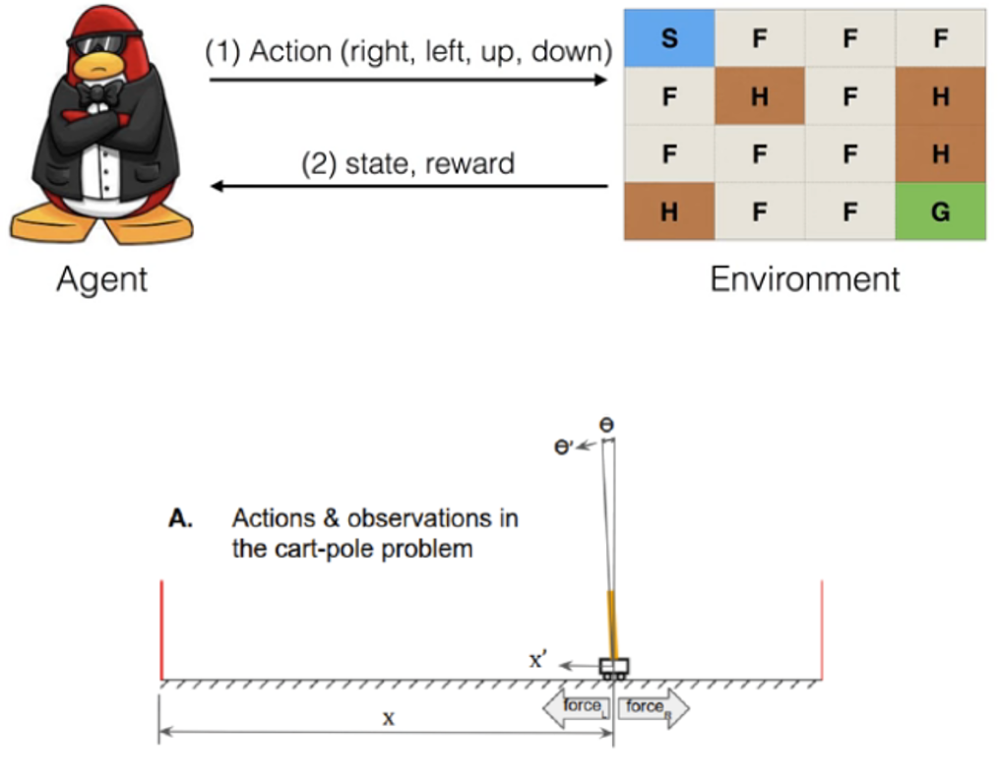
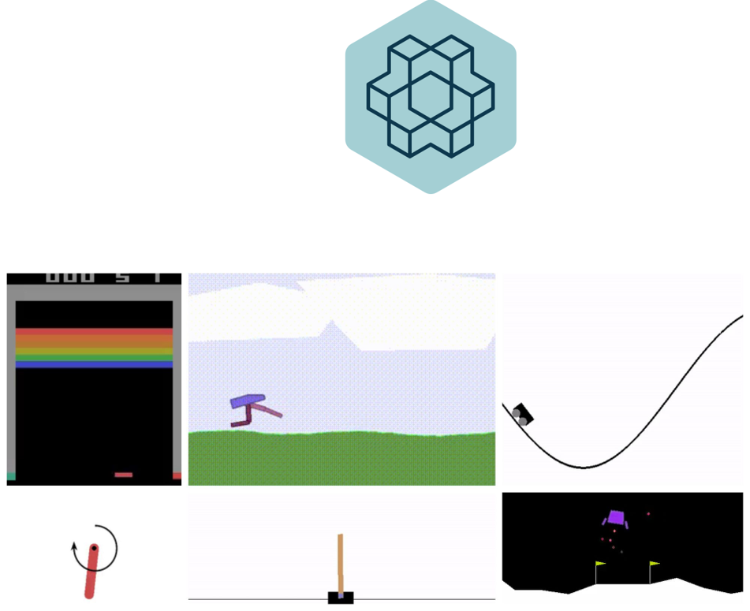

# Spodbujevalno učenje

# Strojno učenje

# Spodbujevalno učenje

- Učenje robotskih strategij v simuliranem okolju
    - OpenAI Gym + Stable Baselines3 
    - Preprosta okolja
    - AirHockey
- Prenos na dejanskega robota
- Vodene + samostojne vaje

- Okolje
    - Stanje okolja
    - Nagrada ta agenta, za določeno stanje
    - Seznam možnih akcij
- Agent
    - Strategija za izbiro najboljših akciji
    - Izvaja in se odloča o najboljši akciji

## Okolje

- Spodbujevalno učenje zahteva veliko ponovitev
    - Zelo nepraktično za razvoj na robotu
    - Učenje v simulaciji okolja -> Env
    - Zbirka okolij -> Gym

- OpenAI Gym okolja za izvajanje spodbujevalnega učenja
https://gym.openai.com/

- OpenAI Gym
    - Simulacij različnih okolij
    - Pred pripravljena okolja
    - Struktura za razvoj lastnih okolij

https://gym.openai.com/envs/FrozenLake-v0/
https://gym.openai.com/envs/#robotics

